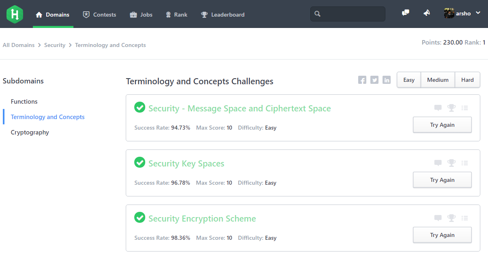

## Hackerrank Security Domain Solutions

My solutions of [Hackerrank Security Domain](https://www.hackerrank.com/domains/security) challenges. The codes may give a head start, if you are stuck in somewhere! 

If you have better code (I like readable code rather than short liner), send pull request.

Bonus: I have created `Hackerrank_Solution_Blank_File_Creator.py` to generate the blank file of each challenges. Have a look in [HackerrankUtility](/HackerrankUtility) folder.

<b>Solutions listed in Hackerrank_Security_Domain_Solutions</b>
<ul>
  <li>Functions
    <ul>
      <li>Security Functions</li>
      <li>Security Functions II</li>
      <li>Security Bijective Functions</li>
      <li>Security Function Inverses</li>
      <li>Security Permutations</li>
      <li>Security Involution</li>
    </ul>
  </li>
  <li>Terminology and Concepts
    <ul>
      <li>Security - Message Space and Ciphertext Space</li>
      <li>Security Key Spaces</li>
      <li>Security Encryption Scheme</li>
    </ul>
  </li>
  <li>Cryptography
    <ul>
      <li>PRNG Sequence Guessing</li>
      <li>Keyword Transposition Cipher</li>
      <li>Basic Cryptanalysis</li>
    </ul>
  </li>
</ul>

### How to use `HackerrankUtility`:
- Open [HackerrankUtility/Hackerrank_Solution_Blank_File_Creator.py](HackerrankUtility/Hackerrank_Solution_Blank_File_Creator.py) and edit the author name.
- Save and run the file.
- Blank file to create your solution for each challenge will be created in relevent subdomain.

Watch demonstration process in [Youtube: Hackerrank Solution Blank File Creator DEMO](https://youtu.be/G3hq5upfPEI).

